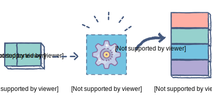
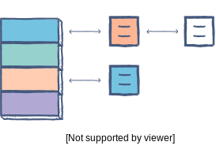
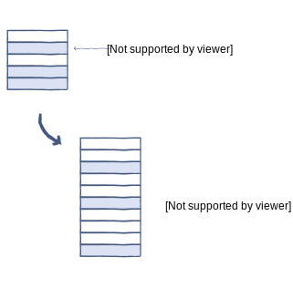

# Hash Tables

## Table of Contents
- [Definitions](#definitions)
- [Time and Space Complexity](#time-and-space-complexity)
- [How it works](#how-it-works)
  * [Component 1: Hashing function](#component-1--hashing-function)
    + [Definitions](#definitions-1)
    + [Example](#example)
  * [Component 2: Array](#component-2--array)
  * [Collisions in hash tables & resolutions](#collisions-in-hash-tables---resolutions)
    + [Collision Resolution: Linear Probing](#collision-resolution--linear-probing)
    + [Collision Resolution: Chaining](#collision-resolution--chaining)
    + [Collision Resolution: Resizing the hash table](#collision-resolution--resizing-the-hash-table)
  * [Examples](#examples)
- [Pros and Cons](#pros-and-cons)
  * [Benefits](#benefits)
  * [Downfalls](#downfalls)
  * [Mitigations for Downfalls](#mitigations-for-downfalls)
- [Other Notes](#other-notes)
- [Sources](#sources)

## Definitions
1. A hash table, also known as a hash map, is a data structure
that **maps keys to values**. It is one part of a technique called
hashing, the other of which is a hash function. A hash function
is an algorithm that produces an index of where a value can be
found or stored in the hash table - [Free Code Camp][1].

2. A hash table is a type of data structure that stores **key-value pairs**.
The key is sent to a hash function that performs arithmetic operations
on it. The result (commonly called the hash value or hash) is the
index of the key-value pair in the hash table - [Edpresso][2].

3. A hash table is an **unordered** collection of **key-value pairs**, where
each key is unique - [yourbasic.org][3].

## Time and Space Complexity
| Algorithm     | Average       | Worst Case    |
| ------------- | ------------- | ------------- |
| Space         | `O(n)`        | `O(n)`        |
| Search        | `O(1)`        | `O(n)`        |
| Insert        | `O(1)`        | `O(n)`        |
| Delete        | `O(1)`        | `O(n)`        |

## How it works
### Component 1: Hashing function
#### Definitions
1. As we’ve already seen, the hash function determines the index of
our key-value pair - [Edpresso][2].

2. A hash function is any function that can be used to map data of
arbitrary size to fixed-size values. The values returned by a hash
function are called hash values, hash codes, digests, or simply
hashes. The values are used to index a fixed-size table called a
hash table. Use of a hash function to index a hash table is called
hashing or scatter storage addressing - [Wikipedia][4].

Choosing an efficient hash function is a crucial
part of creating a good hash table. You should always ensure that it’s
a one-way function, i.e., the key cannot be retrieved from the hash.
Another property of a good hash function is that it avoids producing
the same hash for different keys.

#### Example
```typescript
const index = hashFunc(key, arraySize);

function hashFunc(key: string, arraySize: number): number {
  const hash = hash(key);
  return hash % arraySize;
}

// You will want a more robust hasing algorithm than this
// because the code below will cause a lot of collisions.
// For example, your hash algorithm could take the string
// key, calculate the binary representation, which will be
// modded by the array size to find the index.
function hash(key: string): number {
  return key.length;
}
```

Using this method, hash is independent of the size of the hash table.
The hash is reduced to an index – a number between `0`, the start of
the array, and `arraySize - 1`, the end of the array – using the
modulo `(%)` operator.

### Component 2: Array
The array holds all the key-value entries in the table. In most hash
tables, the array is usually an array of linked lists.

The size of the array should be set according to the amount of data expected.
In most dynamic languages such as Python and JS, the array is
auto-sized by default. But you have to check what the default
behavior is in your language.



### Collisions in hash tables & resolutions
A collision occurs when two keys get mapped to the same index. There
are several ways of handling collisions.

#### Collision Resolution: Linear Probing
If a pair is hashed to a slot which is already occupied, it searches
linearly for the next free slot in the table.

#### Collision Resolution: Chaining
The hash table will be an array of linked lists. All keys mapping to
the same index will be stored as linked list nodes at that index.



#### Collision Resolution: Resizing the hash table
The size of the hash table can be increased in order to spread the
hash entries further apart. A threshold value signifies the percentage
of the hash table that needs to be occupied before resizing. A hash
table with a threshold of 0.6 would resize when 60% of the space is
occupied. As a convention, the size of the hashtable is doubled. This
can be memory intensive.



### Examples

The example below is implemented in TypeScript and using 2D arrays. Key-value pairs are also
represented as simple arrays where `[key=Country, value=Capital City]` for simplicty. But you
could always convert the countries, capitals, and key-value pairs into their own classes to
provide more functionality.

```typescript
[
  // Hashing algo produced index 0
  ["New Zealand", "Auckland"],
  // Hashing algo produced index 1 and created collisions.
  [["United States", "Washington DC"], ["France", "Paris"]],
  // Hashing algo produced index 2
  ["England", "London"],
]
```

**Step-by-Step: No Collision**
1. Try to access the key `"New Zealand"` by using `countries["New Zealand"]`;
2. The hashing algorithm takes the key `"New Zealand"` and using the hashing function, it
determines the index at which it can find the key `"New Zealand"`. Because the hashing function
is one way, given the same key, it will always produce the same index;
3. This will result in the index value `0`;
4. The hash table access algorithm retrieves the value(s) at index `0` and sees there is only
one key-value pair;
5. It retrieves the value at index `0`;
6. It returns that key-value pair.

Because accessing an array at a specified index has a constant time `O(1)` time complexity,
it gives the Hash Table solution a best-case scenario time complexity of `O(1)`. That however,
assumes the hashing algorithm also has constant time. If the hashing algorithm has a time
complexity of `n^2` then the Hash Table will also have a time complexity of `n^2`.

**Step-by-Step: Collision**
1. Try to access the key `"France"` by using `countries["France"]`;
2. The hashing algorithm takes the key `"France"` and using the hashing function, it
determines the index at which it can find the key `"France"`. Because the hashing function
is one way, given the same key, it will always produce the same index;
3. This will result in the index value `1`;
4. The hash table access algorithm retrieves the value(s) at index `1` and sees there is more
than one key-value pair;
5. It iterates over the retrieved array to find the key `"France"`;
6. After two iterations, it finds the key-value pair `["France", "Paris"]`;
7. It returns that key-value pair.

From the collision access example above, you can see how you need to iterate over collision
values (at index 1) to find the appropriate key. This is why as the amount of colissions
increases, the Hash Table begins to resemble a time complexity of `O(n)`.

## Pros and Cons

### Benefits
- Fast and efficient way for looking up, creating, and deleting stored data.
The average case time complexity is `O(1)` constant time and the worst case
scenario is `O(n)` linear time.
  - In a linked list an insertion can be efficient, but lookups
  take `O(n)` linear time.
  - Binary search trees have an average time complexity of `O(log n)`
  logarithmic time complexity and worst case of linear `O(n)`.

### Downfalls
- Values are not stored in a sorted order.
- You mush account for potential collisions.
- Hashing can also be inefficient when there are too many collisions.
  - As the number of collisions increase, (for chaining solution) the
  larger the linked list will get and begin to represent a more
  linear `O(n)` time complexity.

### Mitigations for Downfalls
- A programmer can get around the issue of too many collisions
by re-hashing or “re-sizing” the hash table. Re-hashing can be done
gradually or all at once, but either way the time complexity for this
action will be `O(n)`.

## Other Notes
- Hash table arrays are sometimes referred to as "buckets".

## Sources
- [Free Code Camp | Hash Tables][1]
- [Edpresso | What is a hash table][2]
- [yourbasic.org | Hash Tables Explained][3]
- [Wikipedia | Hash Function][4]

[1]: https://www.freecodecamp.org/news/hash-tables/
[2]: https://www.educative.io/edpresso/what-is-a-hash-table
[3]: https://yourbasic.org/algorithms/hash-tables-explained/
[4]: https://en.wikipedia.org/wiki/Hash_function
