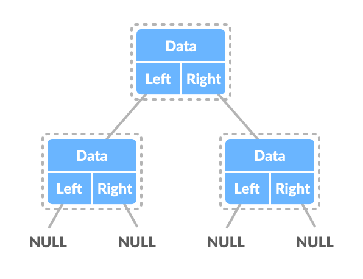

# Binary Search Tree (BST)

## Table of Contents
- [Definitions](#definitions)
- [Time and Space Complexity](#time-and-space-complexity)
- [Representation](#representation)
- [Pros and Cons](#pros-and-cons)
  * [Benefits](#benefits)
  * [Downfalls](#downfalls)
- [Sources](#sources)

## Definitions
1. In computer science, a binary search tree (BST), also called an **ordered or sorted** binary
tree, is a rooted binary tree whose internal nodes each store a key greater than all the
keys in the node's left subtree and less than those in its right subtree.
A binary tree is a type of data structure for storing data such as numbers in an organized
way - [Wikipedia][1].

2. Binary Search Tree is a node-based binary tree data structure which has the following properties ([GeeksforGeeks][2]):
    * The left subtree of a node contains only nodes with keys lesser than the node’s key.
    * The right subtree of a node contains only nodes with keys greater than the node’s key.
    * The left and right subtree each must also be a binary search tree.

## Time and Space Complexity

| Algorithm | Average     | Worst Case |
| --------- | -------     | ---------- |
| Space     | `O(n)`      | `O(n)`     |
| Access    | `O(log n)`  | `O(n)`     |
| Search    | `O(log n)`  | `O(n)`     |
| Insert    | `O(log n)`  | `O(n)`     |
| Delete    | `O(log n)`  | `O(n)`     |

## Representation

```typescript
class Node {
  constructor(
    public data: number, 
    public left: Node, // All items are smaller than items in right node
    public right: Node, // All items are greater than items in left node
  )
}
```



## Pros and Cons

### Benefits
- Compared to linear search (checking each element in the array starting from the first),
binary search is much faster. Linear search takes, on average `N/2` comparisons
(where `N` is the number of elements in the array), and worst case `N` comparisons. Binary
search takes an average and worst-case `𝑙𝑜𝑔2(𝑁)` comparisons. So for a million elements, linear search would take an average of 500,000 comparisons, whereas binary search would take 20.
- It’s a fairly simple algorithm.
- It’s well known and often implemented for you as a library routine.
- We have an ordering of keys stored in the tree. Any time we need to traverse the
increasing (or decreasing) order of keys, we just need to do the
in-order (and reverse in-order) traversal on the tree.
- We can also do range queries - find keys between N and M (N <= M).
- BST can also be used in the design of memory allocators to speed up the search of
free blocks (chunks of memory), and to implement best fit algorithms where we are
interested in finding the smallest free chunk with size greater than or equal to
size specified in allocation request.

### Downfalls
- It’s more complicated than linear search, and is overkill for very small numbers of elements.
- It works only on lists that are sorted and kept sorted. That is not always feasable,
especially if elements are constantly being added to the list.
- It works only on element types for which there exists a less-than relationship. Some
types simply cannot be sorted (though this is rare). For example, in Java you can implement
the `Comparable` interface and compare non-number data structures.
- There is a great lost of efficiency if the list does not support random-access. You
need, for example, to immediately jump to the middle of the list. If your list is a
plain array, that’s great. If it’s a linked-list, not so much. Depending on the cost
of your comparison operation, the cost of traversing a non-random-access list could
dwarf the cost of the comparisons.
- **There are even faster search methods available, such as hash lookups**. However a
hash lookup requires the elements to be organized in a much more complicated data
structure (a hash table, not a list).
- The main disadvantage is that we should always implement a balanced binary
search tree. Otherwise the cost of operations may not be logarithmic and degenerate into
a linear search on an array.

## Sources
- [Wikipedia | Binary search tree][1]
- [GeeksforGeeks | Binary Search Tree][2]
- [Quora | What are the Advantages and Disadvantages of Binary Search?][3]
- [GeeksforGeeks Practice | Advantages and disadvantages of BST][4]

[1]: https://en.wikipedia.org/wiki/Binary_search_tree
[2]: https://www.geeksforgeeks.org/binary-search-tree-data-structure/
[3]: https://www.quora.com/What-are-the-advantages-and-disadvantages-of-binary-search
[4]: https://practice.geeksforgeeks.org/problems/advantages-and-disadvantages-of-bst
