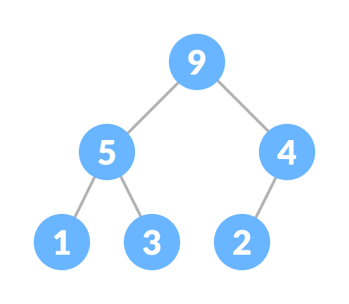
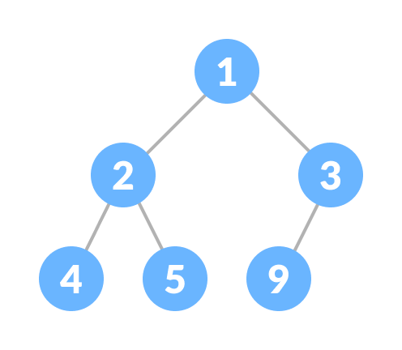
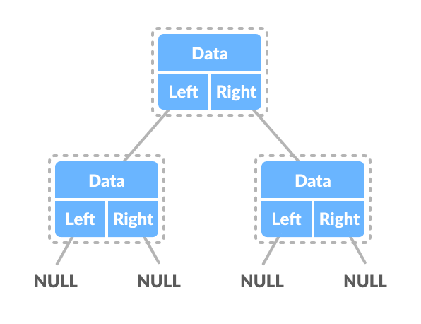
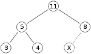

# Heap (Binary)

## Table of Contents
- [Definitions](#definitions)
  * [Complete Binary Tree](#complete-binary-tree)
  * [Heap Property](#heap-property)
- [Representation](#representation)
- [How it works](#how-it-works)
  * [Implementation](#implementation)
  * [Insertion](#insertion)
  * [Extract](#extract)
  * [Search](#search)
  * [Delete](#delete)
  * [Decrease or Increase Key](#decrease-or-increase-key)
    + [Decrease Key:](#decrease-key-)
    + [Increase Key:](#increase-key-)
- [Pros and Cons](#pros-and-cons)
  * [When Compared to Stack Data Structure for Memory](#when-compared-to-stack-data-structure-for-memory)
    + [Benefits](#benefits)
    + [Downfalls](#downfalls)
- [Sources](#sources)

## Definitions
1. Heap data structure is a complete binary tree that satisfies the **heap property**. It
is also called as a binary heap. - [Programiz][2]

### Complete Binary Tree
A complete binary tree is a special binary tree in which every level, except possibly
the last, is filled all the nodes are as far left as possible.


### Heap Property
- (for max heap) key of each node is always greater than its child node/s and the key
of the root node is the largest among all other nodes. The same property must be
recursively true for all sub-trees in that Binary Tree.



- (for min heap) key of each node is always smaller than the child node/s and the key
of the root node is the smallest among all other nodes. The same property must be
recursively true for all sub-trees in that Binary Tree.



Unlike the binary search tree, the entire left-side of the tree doesn't contain values
only lower than those on the right. Each node and its children are treated independently.
As you can see, `40` on the left tree is greater than `30` on the right tree.


## Representation

```typescript
class Node {
  constructor(
    public data: number, 
    public left: Node, // All items are smaller than items in right node
    public right: Node, // All items are greater than items in left node
  )
}
```



## How it works

### Implementation
Binary heaps are always complete trees so they are often implemented using arrays to
create an implicit data structure. Because arrays are used and arrays are a
contiguous block of memory, space can be saved by removing the requirement to store
pointers.

### Insertion
To add an element to a heap, we can perform this algorithm:

1. Add the element to the bottom level of the heap at the leftmost open space.
2. Compare the added element with its parent; if they are in the correct order, stop.
3. If not, swap the element with its parent and return to the previous step.

Steps 2 and 3, which restore the heap property by comparing and possibly swapping a node
with its parent, are called the **up-heap** operation (also known as bubble-up,
percolate-up, sift-up, trickle-up, swim-up, heapify-up, or cascade-up).

The number of operations required depends only on the number of levels the new element
must rise to satisfy the heap property. Thus, the insertion operation has a worst-case
time complexity of `O(log n)`. For a random heap, and for repeated insertions, the
insertion operation has an average-case complexity of `O(1)`.

As an example of binary heap insertion, say we have a max-heap



and we want to add the number 15 to the heap. We first place the 15 in the position
marked by the X. However, the heap property is violated since 15 > 8, so we need to swap
the 15 and the 8. So, we have the heap looking as follows after the first swap:


However the heap property is still violated since 15 > 11, so we need to swap again:


which is a valid max-heap. There is no need to check the left child after this final step:
at the start, the max-heap was valid, meaning the root was already greater than its left
child, so replacing the root with an even greater value will maintain the property that
each node is greater than its children (11 > 5; if 15 > 11, and 11 > 5, then 15 > 5,
because of the transitive relation).

### Extract
The procedure for deleting the root from the heap (effectively extracting the maximum
element in a max-heap or the minimum element in a min-heap) while retaining the heap
property is as follows:

1. Replace the root of the heap with the last element on the last level.
2. Compare the new root with its children; if they are in the correct order, stop.
3. If not, swap the element with one of its children and return to the previous step.
(Swap with its smaller child in a min-heap and its larger child in a max-heap.)

Steps 2 and 3, which restore the heap property by comparing and possibly swapping a node
with one of its children, are called the **down-heap** (also known as bubble-down,
percolate-down, sift-down, sink-down, trickle down, heapify-down, cascade-down,
extract-min or extract-max, or simply heapify) operation.

So, if we have the same max-heap as before


We remove the 11 and replace it with the 4.


Now the heap property is violated since 8 is greater than 4. In this case, swapping the
two elements, 4 and 8, is enough to restore the heap property and we need not swap
elements further:


The downward-moving node is swapped with the larger of its children in a max-heap
(in a min-heap it would be swapped with its smaller child), until it satisfies the
heap property in its new position.

### Search
Finding an arbitrary element takes `O(n)` time. This can be reduced to amortized
`O(1)` time if we have a hash table mapping heap elements to heap indices or
element pointers.

### Delete
Deleting an arbitrary element can be done as follows:

1. Find the index of the element we want to delete
2. Swap this element with the last element
3. Down-heapify and up-heapify to restore the heap property. Both are required when we
delete a node that is not some parent of last node, for example, on a different
subtree of root, also because the node delete might be in an internal node. Even
though both down-heap and up-heap are called only required number of operations happen,
after which the heap property is restored.

### Decrease or Increase Key
The decrease key operation replaces the value of a node with a given value with a
lower value, and the increase key operation does the same but with a higher value.
This involves finding the node with the given value, changing the value, and then
down-heapifying or up-heapifying to restore the heap property.

#### Decrease Key:

1. Find the index of the element we want to modify.
2. Decrease the value of the node.
3. Down-heapify (assuming a max heap) to restore the heap property.

#### Increase Key:

1. Find the index of the element we want to modify.
2. Increase the value of the node.
3. Up-heapify (assuming a max heap) to restore the heap property.

## Pros and Cons

### When Compared to Stack Data Structure for Memory

#### Benefits
- Heap helps you to find the greatest and minimum number
- Garbage collection runs on the heap memory to free the memory used by the object.
- Heap method also used in the Priority Queue.
- It allows you to access variables globally.
- Heap doesn't have any limit on memory size.

#### Downfalls
- It takes more time to compute.
- Memory management is more complicated in heap memory as it is used globally.
- It takes too much time in execution compared to the stack.

## Sources
- [GeeksforGeeks | Heap Data Structure][1]
- [Programiz | Heap Data Structure][2]
- [Wikipedia | Binary Heap][3]
- [Gruu99 | Stack vs Heap][3]

[1]: https://www.geeksforgeeks.org/heap-data-structure/
[2]: https://www.programiz.com/dsa/heap-data-structure
[3]: https://en.wikipedia.org/wiki/Binary_heap#:~:text=The%20number%20of%20operations%20required,complexity%20of%20O(1).
[4]: https://www.guru99.com/stack-vs-heap.html
