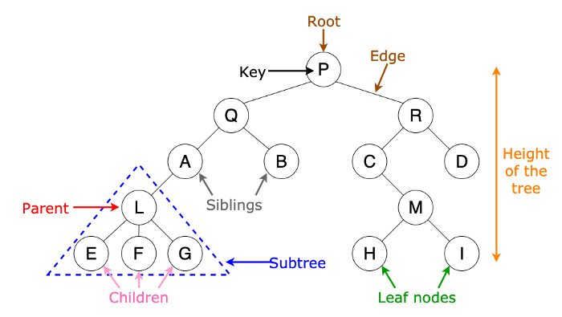
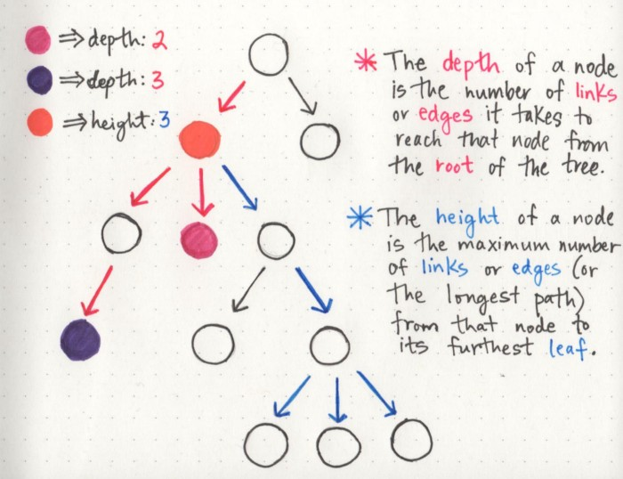
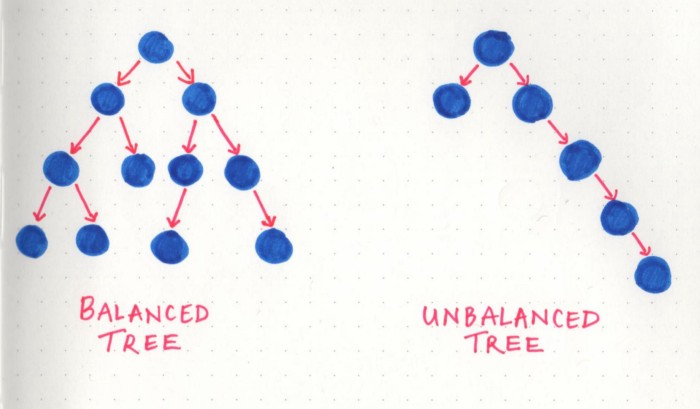
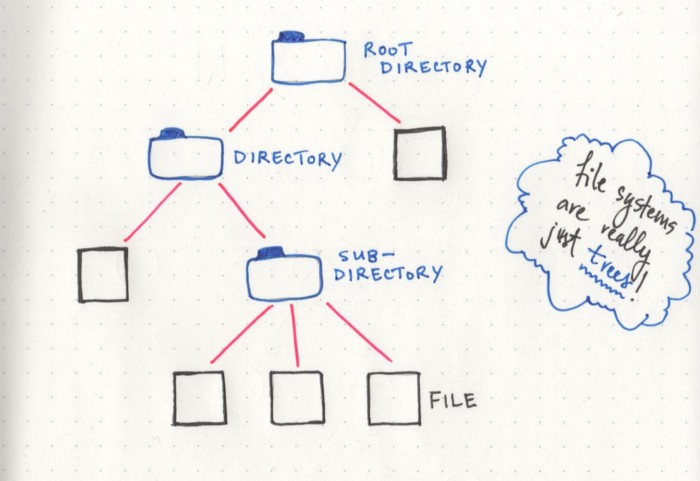

# Trees

## Table of Contents

## Definitions
1. Unlike Array and Linked List, which are linear data structures, tree is hierarchical (or non-linear) data structure - [GeeksforGeeks][1].

2. What comes to your mind when you think of a tree? Roots, branches and leaves? A big oak tree with roots, branches and leaves may come to your mind. Similarly, in computer science, the tree data structure has roots, branches and leaves, but it is drawn upside-down. A tree is a hierarchical data structure which can represent relationships between different nodes - [Towards Data Science][2].

## Parts of a Tree

* **Root**: the topmost node of the tree, which never has any links or edges connecting
to it
* **Link/Edge**: the reference that a parent node contains that tells it what its child
node is
* **Child**: any node that has a parent node that links to it
* **Parent**: any node that has a reference or link to another node
* **Sibling**: any group of nodes that are the children of the same node
* **Internal**: any node that has a child node (basically all parent nodes)
* **Leaf**: any node that does not have a child node in the tree

If these terms feel overwhelming at all, I find it helpful to think of tree data
structures like a family tree, or even a corporate ladder. The data is always hierarchical.
You’ll have someone (a root node) at the top, that delegates to some other nodes
(parent nodes), which may or may have someone else reporting to them (child nodes). Or
you have a huge family, with parent nodes, children nodes, all leading back up to an
ancestral root node.

Just as long as you can remember that the data is hierarchical in nature, the jargon
should hopefully be little less worrisome to think about.

### General properties of a tree
1. A tree can contain no nodes or it can contain one special node called the root with
zero or more subtrees.
2. Every edge of the tree is directly or indirectly originated from the root.
3. Every child has only one parent, but one parent can have many children.
4. If a tree has n nodes, it will always have one less number of edges (n-1).
5. Trees are recursive data structures because a tree is usually composed of smaller
trees — often referred to as subtrees — inside of it.

For the most part, the two properties that we will be the most concerned with are either
the **depth** of a node or the **height** of a node.

#### Depth
A simple way to think about the depth of a node is by answering the question: how far
away is the node from the root of the tree?

But how do we know what far is, in this case? Well, even though we haven’t gotten into
all of the complexities of tree traversal just yet, there’s only one way to traverse or
search through a tree: by making a path and following the edges/links from the root 
node down. So, we could determine how far a node is from the root node by counting
the number of links that it takes to reach that node from the root node.

In the example shown here, the depth of the pink node is 2, because there are
exactly 2 links connecting the root node to the pink node. However, the depth of
the purple node is 3, because it takes 3 links to traverse down from the root node
to the purple node.

#### Height
The height of a node can be simplified by asking the question: how far is this node
from its furthest-away leaf?

The cool thing about the height property in particular is that the height of the root
node is automatically the height of the entire tree itself. Basically, this means that
once we find the leaf node that is the furthest away from the root, we now know the
longest possible path in the tree, which tells us how tall it actually is!

#### Balanced vs. Unbalanced Trees
**Balanced Tree:** A tree is considered to be balanced if any two sibling subtrees do not differ in height by more than one level. 

**Unbalanced Tree:** If two sibling subtrees differ significantly in height (and have more than one level of depth of difference), the tree is unbalanced.

Balanced trees come up when we talk about tree operations, and traversal in particular.
The idea behind this is that if we can traverse a tree and cut down on half of the number
of operations, we’ll have a better performing data structure. However, in an unbalanced
tree, this definitely is not the case, because one subtree could be significantly larger
than its sibling’s subtree.

The worst-case time-complexity scenarios are usually associated with unbalanced trees.

## Example of tree algorithms
This is not an exhaustive list of possible tree structures.

1. **General Tree:** A general tree is a tree data structure where there are no constraints
on the hierarchical structure.
2. **Binary Search Tree** is a tree that allows fast search, insert, delete on a sorted data.
It also allows finding closest item.
3. **Heap** is a tree data structure which is implemented using arrays and used to implement
priority queues.
4. **B-Tree and B+ Tree**: They are used to implement indexing in databases.
5. **Syntax Tree:** Used in Compilers.
6. **K-D Tree:** A space partitioning tree used to organize points in K dimensional space.
7. **Trie:** Used to implement dictionaries with prefix lookup.
8. **Suffix Tree:** For quick pattern searching in a fixed text.
9. **Spanning Trees and Shortest-Path trees** are used in routers and bridges respectively
in computer networks.
10. **AVL Tree:**
11. **Red-Black Tree:**
12. **Splay Tree:**
13. **Treap:**
14. **Binary tree**

### Real-World Examples of Trees

#### Class Hierarchy in Object Orientated Programming
One simple example lies within object oriented languages: the main Object is the root
node, while classes that inherit from it are children of the main class. This makes more
sense as you think about it; the fact that it’s often called a “class hierarchy” lends
itself nicely to the hierarchal tree data structure.

#### File Structure in Operating Systems
The most obvious one (that maybe may not have been obvious until now!) is the file
structure of a project — or even the file system on your computer! If we think about
it, all the important pieces are already there: a root directory, with child nodes that
could be subdirectories of their own, or leaves of the tree that end with just a simple
file. All of it is really just a hierarchical tree data structure!

## Pros and Cons

#### Benefits
- Good for storing information that naturally forms a hierarchy e.g. computer file system.
- If we organize keys in form of a tree (with some ordering e.g., BST), we can search for a given key in moderate time.

## Sources
- [GeeksforGeeks | Applications of Tree Data Structures][1]
- [Towards Data Science | 8 Useful Tree Data Structures Worth Knowing][2]
- [Base CS | How To Not Be Stumped By Trees][2]

[1]: https://www.geeksforgeeks.org/applications-of-tree-data-structure/
[2]: https://towardsdatascience.com/8-useful-tree-data-structures-worth-knowing-8532c7231e8c
[3]: https://medium.com/basecs/how-to-not-be-stumped-by-trees-5f36208f68a7
