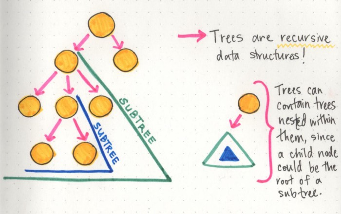

# Trees

## Table of Contents
- [Parts of a Tree](#parts-of-a-tree)
  * [General properties of a tree](#general-properties-of-a-tree)
    + [Depth](#depth)
    + [Height](#height)
    + [Balanced vs. Unbalanced Trees](#balanced-vs-unbalanced-trees)
- [Example of tree algorithms](#example-of-tree-algorithms)
  * [Real-World Examples of Trees](#real-world-examples-of-trees)
    + [Class Hierarchy in Object Orientated Programming](#class-hierarchy-in-object-orientated-programming)
    + [File Structure in Operating Systems](#file-structure-in-operating-systems)
- [Tree Traversal](#tree-traversal)
  * [Definitions](#definitions)
  * [Traversal Types](#traversal-types)
    + [Depth-First Search (DFS) Algorithm](#depth-first-search--dfs--algorithm)
    + [Breadth-First Search (BFS) Algorithm](#breadth-first-search--bfs--algorithm)
    + [Practical Guide](#practical-guide)
      - [Depth-First Search](#depth-first-search)
        * [Inorder Traversal](#inorder-traversal)
        * [Preorder Traversal](#preorder-traversal)
        * [Postorder Traversal](#postorder-traversal)
      - [Breadth-First Search](#breadth-first-search)
        * [Level Order Traversal](#level-order-traversal)
- [Pros and Cons](#pros-and-cons)
    + [Benefits](#benefits)
- [Sources](#sources)

## Definitions
1. Unlike Array and Linked List, which are linear data structures, tree is hierarchical (or non-linear) data structure - [GeeksforGeeks][1].

2. What comes to your mind when you think of a tree? Roots, branches and leaves? A big oak tree with roots, branches and leaves may come to your mind. Similarly, in computer science, the tree data structure has roots, branches and leaves, but it is drawn upside-down. A tree is a hierarchical data structure which can represent relationships between different nodes - [Towards Data Science][2].

## Parts of a Tree


* **Root**: the topmost node of the tree, which never has any links or edges connecting
to it.
* **Link/Edge**: the reference that a parent node contains that tells it what its child
node is.
* **Child**: any node that has a parent node that links to it.
* **Parent**: any node that has a reference or link to another node.
* **Sibling**: any group of nodes that are the children of the same node.
* **Internal**: any node that has a child node (basically all parent nodes).
* **Leaf**: any node that does not have a child node in the tree.
* **Breath**: the number of leaves.

If these terms feel overwhelming at all, I find it helpful to think of tree data
structures like a family tree, or even a corporate ladder. The data is always hierarchical.
You’ll have someone (a root node) at the top, that delegates to some other nodes
(parent nodes), which may or may have someone else reporting to them (child nodes). Or
you have a huge family, with parent nodes, children nodes, all leading back up to an
ancestral root node.

Just as long as you can remember that the data is hierarchical in nature, the jargon
should hopefully be little less worrisome to think about.

### General properties of a tree
1. A tree can contain no nodes or it can contain one special node called the root with
zero or more subtrees.
2. Every edge of the tree is directly or indirectly originated from the root.
3. Every child has only one parent, but one parent can have many children.
4. If a tree has n nodes, it will always have one less number of edges (n-1).
5. Trees are recursive data structures because a tree is usually composed of smaller
trees — often referred to as subtrees — inside of it.

For the most part, the two properties that we will be the most concerned with are either
the **depth** of a node or the **height** of a node.



#### Depth
A simple way to think about the depth of a node is by answering the question: how far
away is the node from the root of the tree?

But how do we know what far is, in this case? Well, even though we haven’t gotten into
all of the complexities of tree traversal just yet, there’s only one way to traverse or
search through a tree: by making a path and following the edges/links from the root 
node down. So, we could determine how far a node is from the root node by counting
the number of links that it takes to reach that node from the root node.

In the example shown here, the depth of the pink node is 2, because there are
exactly 2 links connecting the root node to the pink node. However, the depth of
the purple node is 3, because it takes 3 links to traverse down from the root node
to the purple node.


#### Height
The height of a node can be simplified by asking the question: how far is this node
from its furthest-away leaf?

The cool thing about the height property in particular is that the height of the root
node is automatically the height of the entire tree itself. Basically, this means that
once we find the leaf node that is the furthest away from the root, we now know the
longest possible path in the tree, which tells us how tall it actually is!

#### Balanced vs. Unbalanced Trees
**Balanced Tree:** A tree is considered to be balanced if any two sibling subtrees do not differ in height by more than one level. 

**Unbalanced Tree:** If two sibling subtrees differ significantly in height (and have more than one level of depth of difference), the tree is unbalanced.


Balanced trees come up when we talk about tree operations, and traversal in particular.
The idea behind this is that if we can traverse a tree and cut down on half of the number
of operations, we’ll have a better performing data structure. However, in an unbalanced
tree, this definitely is not the case, because one subtree could be significantly larger
than its sibling’s subtree.

The worst-case time-complexity scenarios are usually associated with unbalanced trees.

## Example of tree algorithms
This is not an exhaustive list of possible tree structures.

1. **General Tree:** A general tree is a tree data structure where there are no constraints
on the hierarchical structure.
2. **Binary tree:** is a tree data structure in which each node has at most two
children, which are referred to as the left child and the right child.
3. **Binary Search Tree** is a tree that allows fast search, insert, delete on a sorted data.
It also allows finding closest item.
4. **Heap** is a tree data structure which is implemented using arrays and used to implement
priority queues.
5. **B-Tree and B+ Tree**: They are used to implement indexing in databases.
6. **Syntax Tree:** Used in Compilers.
7. **K-D Tree:** A space partitioning tree used to organize points in K dimensional space.
8. **Trie:** Used to implement dictionaries with prefix lookup.
9. **Suffix Tree:** For quick pattern searching in a fixed text.
10. **Spanning Trees and Shortest-Path trees** are used in routers and bridges respectively
in computer networks.
11. **AVL Tree:**
12. **Red-Black Tree:**
13. **Splay Tree:**
14. **Treap:**

### Real-World Examples of Trees

#### Class Hierarchy in Object Orientated Programming
One simple example lies within object oriented languages: the main Object is the root
node, while classes that inherit from it are children of the main class. This makes more
sense as you think about it; the fact that it’s often called a “class hierarchy” lends
itself nicely to the hierarchal tree data structure.

#### File Structure in Operating Systems
The most obvious one (that maybe may not have been obvious until now!) is the file
structure of a project — or even the file system on your computer! If we think about
it, all the important pieces are already there: a root directory, with child nodes that
could be subdirectories of their own, or leaves of the tree that end with just a simple
file. All of it is really just a hierarchical tree data structure!


## Tree Traversal
### Definitions
Unlike linear data structures (Array, Linked List, Queues, Stacks, etc) which have only
one logical way to traverse them, trees can be traversed in different ways
- [GeeksforGeeks][4].

In computer science, tree traversal (also known as tree search) is a form of graph
traversal and refers to the process of visiting (checking and/or updating) each node
in a tree data structure, exactly once. Such traversals are classified by the order
in which the nodes are visited
- [Wikipedia][5].

### Traversal Types
Tree Traversal Algorithms can be classified broadly in the following two categories
by the order in which the nodes are visited:

#### Depth-First Search (DFS) Algorithm
It starts with the root node and first visits all nodes of one branch as deep as
possible of the chosen Node and before backtracking, it visits all other branches
in a similar fashion. There are three sub-types under this, which we will cover in
this article.

#### Breadth-First Search (BFS) Algorithm
It also starts from the root node and visits all nodes of current depth before
moving to the next depth in the tree. We will cover one algorithm of BFS type in
the upcoming section.

#### Practical Guide
Below is the blueprint of our Node class which will act as the atomic member of
the Tree Data Structure. We will call it TreeNode, which is holding data as an
integer value, left and right children of the same type(TreeNode). You can use
any other data structure to keep as data under the TreeNode.

```java
/**
 * This assumes a binary tree with only two nodes.
 * If there are more than 2 children, TreeNode left; and TreeNode right;
 * can be replaced with something like List<TreeNode>
 **/
public class TreeNode {
	int data;
	TreeNode left;
	TreeNode right;

	public TreeNode(int data) {
		this.data = data;
		this.left = this.right = null;
	}
}
```

##### Depth-First Search

###### Inorder Traversal
Inorder Traversal is the one the most used variant of DFS(Depth First Search)
Traversal of the tree.

As DFS suggests, we will first focus on the depth of the chosen Node and then go
to the breadth at that level. Therefore, we will start from the root node of the
tree and go deeper-and-deeper into the left subtree with recursive manner.

When we will reach to the left-most node with the above steps, then we will visit
that current node and go to the left-most node of its right subtree(if exists).

Same steps should be followed in a recursive manner to complete the inorder
traversal. Order of those steps will be like (in recursive function)...

1. Go to left-subtree
2. Visit Node
3. Go to right-subtree

```java
public void inorderTraversal(TreeNode root) {
	if (root != null) {
		inorderTraversal(root.left);
		System.out.print(root.data + " ");
		inorderTraversal(root.right);
	}
}
```


**Important Fact:** Inorder Traversal of Binary Search Tree will always
give you Nodes in sorted manner.

###### Preorder Traversal
Preorder Traversal is another variant of DFS. Where atomic operations in
a recursive function, are as same as Inorder traversal but with a
different order.

Here, we visit the current node first and then goes to the left sub-tree.
After covering every node of the left sub-tree, we will move towards the
right sub-tree and visit in a similar fashion.

Order of those steps will be like...

1. Visit Node
2. Go to left-subtree
3. Go to right-subtree

```java
public void preorderTraversal(TreeNode root) {
	if (root != null) {
		System.out.print(root.data + " ");
		preorderTraversal(root.left);
		preorderTraversal(root.right);
	}
}
```


###### Postorder Traversal
Similar goes with Postorder Traversal. Where we visit the left subtree
and the right subtree before visiting the current node in recursion.

So, the sequence of the steps will be…

1. Go to left-subtree
2. Go to right-subtree
3. Visit Node

```java
public void postorderTraversal(TreeNode root) {
	if (root != null) {
		postorderTraversal(root.left);
		postorderTraversal(root.right);
		System.out.print(root.data + " ");
	}
}
```


##### Breadth-First Search
###### Level Order Traversal
This is a different traversal than what we have covered above. Level
order traversal follows BFS(Breadth-First Search) to visit/modify every node
of the tree.

As BFS suggests, the breadth of the tree takes priority first and then move
to depth. In simple words, we will visit all the nodes present at the same
level one-by-one from left to right and then move to the next level to visit
all the nodes of that level.


Implementation is slightly challenging here than the above three traversals.
We will use a Queue(FIFO) data structure to implement Level order traversal,
where after visiting a Node, we simply put its left and right children to
queue sequentially.

Here, **the order of adding children in the queue is important** as we have to
traverse left-to-right at the same level. Check out the below gist for
more understanding.

```java
public void levelorderTraversal(TreeNode root) {
	if (root == null) {
		return;
	}

	Queue<TreeNode> queue = new LinkedList<>();
	queue.add(root);

	while (!queue.isEmpty()) {
		TreeNode node = queue.remove();
		System.out.print(node.data + " ");

		if (node.left != null) {
			queue.add(node.left);
		}

		if (node.right != null) {
			queue.add(node.right);
		}
	}
}
```

## Pros and Cons

#### Benefits
- Good for storing information that naturally forms a hierarchy e.g. computer file system.
- If we organize keys in form of a tree (with some ordering e.g., BST), we can search for a given key in moderate time.

## Sources
- [GeeksforGeeks | Applications of Tree Data Structures][1]
- [Towards Data Science | 8 Useful Tree Data Structures Worth Knowing][2]
- [Base CS | How To Not Be Stumped By Trees][3]
- [GeeksforGeeks | Tree Traversals (Inorder, Preorder and Postorder)][4]
- [Towards Data Science | 4 Types of Tree Traversal Algorithms][5]

[1]: https://www.geeksforgeeks.org/applications-of-tree-data-structure/
[2]: https://towardsdatascience.com/8-useful-tree-data-structures-worth-knowing-8532c7231e8c
[3]: https://medium.com/basecs/how-to-not-be-stumped-by-trees-5f36208f68a7
[4]: https://www.geeksforgeeks.org/tree-traversals-inorder-preorder-and-postorder/
[5]: https://towardsdatascience.com/4-types-of-tree-traversal-algorithms-d56328450846
