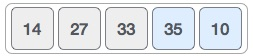
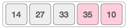
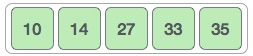

# Bubble Sort

## Table of Contents
- [Time and Space Complexity](#time-and-space-complexity)
- [Definition](#definition)
- [How it works](#how-it-works)
- [Pros and Cons](#pros-and-cons)
  * [Benefits](#benefits)
  * [Downfalls](#downfalls)
- [Sources](#sources)

## Time and Space Complexity

`Ο(n^2)`

## Definition
Bubble sort is a simple sorting algorithm. This sorting algorithm is comparison-based
algorithm in which each pair of adjacent elements is compared and the elements are swapped
if they are not in order. This algorithm is not suitable for large data sets as its average
and worst case complexity are of `Ο(n^2)` where n is the number of items.

## How it works
We take an unsorted array for our example. Bubble sort takes Ο(n2) time so we're keeping
it short and precise.

Bubble sort starts with very first two elements, comparing them to check which one is greater.

In this case, value 33 is greater than 14, so it is already in sorted locations. Next, we
compare 33 with 27.

We find that 27 is smaller than 33 and these two values must be swapped.

The new array should look like this:

Next we compare 33 and 35. We find that both are in already sorted positions.

Then we move to the next two values, 35 and 10.

We know then that 10 is smaller 35. Hence they are not sorted.

We swap these values. We find that we have reached the end of the array. After one
iteration, the array should look like this:

To be precise, we are now showing how an array should look like after each iteration. After the second iteration, it should look like this:

Notice that after each iteration, at least one value moves at the end.

And when there's no swap required, bubble sorts learns that an array is completely sorted.

## Pros and Cons

### Benefits
- Simple

### Downfalls
- Not good for large datasets. Time complexity of `O(n^2)`.

## Sources
- [Tutorials Point | Data Structure - Bubble Sort Algorithm][1]

[1]: https://www.tutorialspoint.com/data_structures_algorithms/bubble_sort_algorithm.htm
