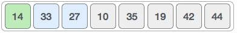
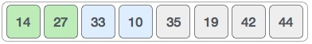
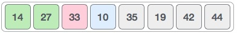
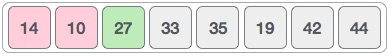

# Insertion Sort

## Table of Contents
- [Time and Space Complexity](#time-and-space-complexity)
- [Definition](#definition)
- [How it works](#how-it-works)
- [Pros and Cons](#pros-and-cons)
  * [Benefits](#benefits)
  * [Downfalls](#downfalls)
- [Sources](#sources)

## Time and Space Complexity

| Algorithm | Best Case | Average  | Worst Case |
| --------- | --------- | -------- | ---------- |
| Space     | `O(1)`    | `O(1)`   | `O(1)`     |
| Sorting   | `O(n)`    | `O(n^2)` | `O(n^2)`   |

## Definition
This is an in-place comparison-based sorting algorithm. Here, a sub-list is maintained
which is always sorted. For example, the lower part of an array is maintained to be
sorted. An element which is to be 'insert'ed in this sorted sub-list, has to find
its appropriate place and then it has to be inserted there. Hence the name, insertion sort.

The array is searched sequentially and unsorted items are moved and inserted into the
sorted sub-list (in the same array). This algorithm is not suitable for large data
sets as its average and worst case complexity are of `Ο(n^2)`, where n is the number
of items.

## How it works
We take an unsorted array for our example.

Insertion sort compares the first two elements.

It finds that both 14 and 33 are already in ascending order. For now, 14 is in sorted sub-list.

Insertion sort moves ahead and compares 33 with 27.

And finds that 33 is not in the correct position.

It swaps 33 with 27. It also checks with all the elements of sorted sub-list. Here we
see that the sorted sub-list has only one element 14, and 27 is greater than 14.
Hence, the sorted sub-list remains sorted after swapping.

By now we have 14 and 27 in the sorted sub-list. Next, it compares 33 with 10.

These values are not in a sorted order.

So we swap them.

However, swapping makes 27 and 10 unsorted.

Hence, we swap them too.

Again we find 14 and 10 in an unsorted order.

We swap them again. By the end of third iteration, we have a sorted sub-list of 4 items.

This process goes on until all the unsorted values are covered in a sorted sub-list.
Now we shall see some programming aspects of insertion sort.

## Pros and Cons

### Benefits
- Simple

### Downfalls
- Not good for large datasets. Time complexity of `O(n^2)`.
- More complex than bubble sort and yet the time complexity is the same.

## Sources
- [Tutorials Point | Data Structure - Bubble Sort Algorithm][1]

[1]: https://www.tutorialspoint.com/data_structures_algorithms/insertion_sort_algorithm.htm
