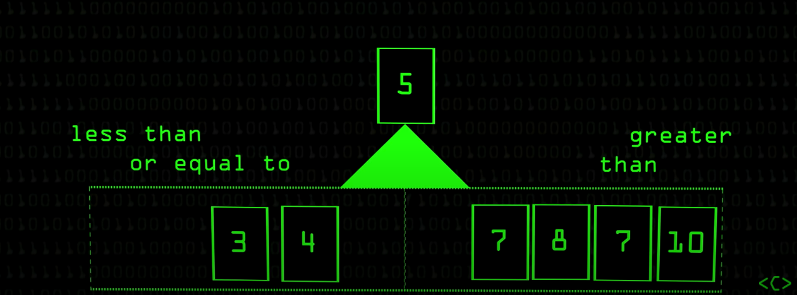

# Quick Sort

## Table of Contents
- [Time and Space Complexity](#time-and-space-complexity)
- [Definition](#definition)
- [How it works](#how-it-works)
- [Pros and Cons](#pros-and-cons)
  * [Benefits](#benefits)
  * [Downfalls](#downfalls)
- [Sources](#sources)

## Time and Space Complexity

| Algorithm | Best Case      | Average        | Worst Case   |
| --------- | -------------- | -------------- | ------------ |
| Space     | `O(log (n))`   | `O(log (n))`   | `O(log (n))` |
| Sorting   | `O(n Log (n))` | `O(n Log (n))` | `O(n^2)`     |

## Definition
Quick sort is a highly efficient sorting algorithm and is based on partitioning of
array of data into smaller arrays. It follows a **divide and conquer** strategy
A large array is partitioned into two arrays one of which holds values smaller
than the specified value, say pivot, based on which the partition is made and
another array holds values greater than the pivot value.

Quicksort partitions an array and then calls itself recursively twice to sort the
two resulting subarrays. This algorithm is quite efficient for large-sized data
sets as its average and worst-case complexity are `O(n Log (n))` and `O(n^2)`,
respectively.

## How it works
1. Given the array below.

2. Take the right-most item in the array and make that the pivot point.

3. Everything on the smaller than the pivot point goes to the left and everything greater than
the pivot point goes to the right.

4. Repeat that process for the subsequent arrays recursively.

5. Merge the left and right sides up with their closest pivot point to get the sorted array.

## Pros and Cons

### Benefits
- Faster than bubble sort.

### Downfalls
- Worst case scenario when sorting an already-sorted array can have a time complexity
of `O(n^2)`.
- Worst case is slower than merge sort.

## Sources
- [Tutorials Point | Data Structure - Bubble Sort Algorithm][1]
- [Computerphile | Quick Sort][2]

[1]: https://www.tutorialspoint.com/data_structures_algorithms/bubble_sort_algorithm.htm
[2]: https://www.youtube.com/watch?v=XE4VP_8Y0BU
