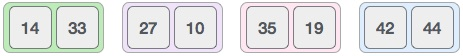
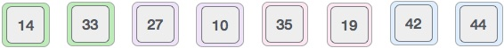

# Merge Sort

## Table of Contents
- [Time and Space Complexity](#time-and-space-complexity)
- [Definition](#definition)
- [How it works](#how-it-works)
- [Pros and Cons](#pros-and-cons)
  * [Benefits](#benefits)
  * [Downfalls](#downfalls)
- [Sources](#sources)

## Time and Space Complexity

| Algorithm | Best Case      | Average        | Worst Case     |
| --------- | -------------- | -------------- | -------------- |
| Space     | `O(n)`         | `O(n)`         | `O(n)`         |
| Sorting   | `O(n Log (n))` | `O(n Log (n))` | `O(n Log (n))` |

## Definition
Merge sort is a sorting technique based on divide and conquer technique. With
worst-case time complexity being Ο(n log n), it is one of the most respected algorithms.

Merge sort first divides the array into equal halves and then combines them in
a sorted manner.

## How it works
1. To understand merge sort, we take an unsorted array as the following:

2. We know that merge sort first divides the whole array iteratively into equal
halves unless the atomic values are achieved. We see here that an array of 8 items
is divided into two arrays of size 4.

3. This does not change the sequence of appearance of items in the original. Now we divide
these two arrays into halves.

4. We further divide these arrays and we achieve atomic value which can no more be divided.

5. Now, we combine them in exactly the same manner as they were broken down. Please note the
color codes given to these lists.

6. We first compare the element for each list and then combine them into another list in a
sorted manner. We see that 14 and 33 are in sorted positions. We compare 27 and 10 and in
the target list of 2 values we put 10 first, followed by 27. We change the order of 19 and
35 whereas 42 and 44 are placed sequentially.

7. In the next iteration of the combining phase, we compare lists of two data values,
and merge them into a list of found data values placing all in a sorted order.

8. After the final merging, the list should look like this:

## Pros and Cons

### Benefits
- Very fast sorting algorithm on average.
- Better space complexity compared to merge sort.

### Downfalls
- There are sorting algorithms with better best-case scenarios.

## Sources
- [Tutorials Point | Data Structure - Merge Sort Algorithm][1]
- [Computerphile | Sorting Algorithms][2]
- [Big O Cheat Sheet][3]

[1]: https://www.tutorialspoint.com/data_structures_algorithms/merge_sort_algorithm.htm
[2]: https://www.youtube.com/watch?v=kgBjXUE_Nwc
[3]: https://www.bigocheatsheet.com/
