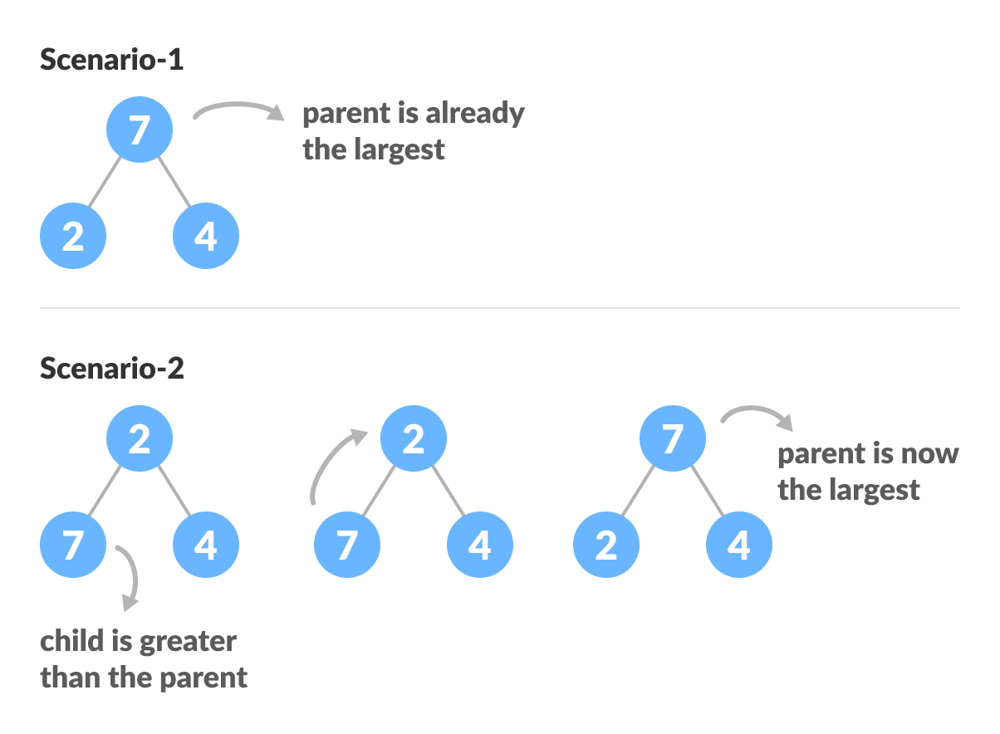

# Merge Sort

## Table of Contents
- [Time and Space Complexity](#time-and-space-complexity)
- [Definition](#definition)
- [How it works](#how-it-works)
  * [Relationship between Array Indexes and Tree Elements](#relationship-between-array-indexes-and-tree-elements)
  * [How to "heapify" a tree](#how-to--heapify--a-tree)
  * [Building max-heap](#building-max-heap)
  * [How Heap Sort Works?](#how-heap-sort-works-)
    + [Python Example](#python-example)
    + [Java Example](#java-example)
- [Pros and Cons](#pros-and-cons)
  * [Benefits](#benefits)
  * [Downfalls](#downfalls)
- [Sources](#sources)

## Time and Space Complexity

| Algorithm | Best Case      | Average        | Worst Case     |
| --------- | -------------- | -------------- | -------------- |
| Space     | `O(1)`         | `O(1)`         | `O(1)`         |
| Sorting   | `O(n Log (n))` | `O(n Log (n))` | `O(n Log (n))` |

## Definition
Heap Sort is a popular and efficient sorting algorithm in computer programming.
Learning how to write the heap sort algorithm requires knowledge of two types of
data structures - arrays and trees.

The initial set of numbers that we want to sort is stored in an array
e.g. `[10, 3, 76, 34, 23, 32]` and after sorting, we get a sorted array `[3,10,23,32,34,76]`.

Heap sort works by **visualizing the elements of the array as a special kind of complete
binary tree called a heap**.

## How it works

### Relationship between Array Indexes and Tree Elements
A complete binary tree has an interesting property that we can use to find the children
and parents of any node.

If the index of any element in the array is i, the element in the index `2i + 1` will
become the left child and element in `2i + 2` index will become the right child. Also,
the parent of any element at index `i` is given by the lower bound of `(i - 1) / 2`.

Understanding this mapping of array indexes to tree positions is critical to
understanding how the Heap Data Structure works and how it is used to implement Heap Sort.

### How to "heapify" a tree
Starting from a complete binary tree, we can modify it to become a Max-Heap by
running a function called heapify on all the non-leaf elements of the heap.

Since heapify uses recursion, it can be difficult to grasp. So let's first think about
how you would heapify a tree with just three elements.

```golang
heapify(array)
    Root = array[0]
    Largest = largest( array[0] , array [2*0 + 1]. array[2*0 + 2])
    if (Root != Largest)
          Swap(Root, Largest)
```




The example above shows two scenarios - one in which the root is the largest element
and we don't need to do anything. And another in which the root had a larger element
as a child and we needed to swap to maintain max-heap property.

If you're worked with recursive algorithms before, you've probably identified that this
must be the base case.

Now let's think of another scenario in which there is more than one level.


The top element isn't a max-heap but all the sub-trees are max-heaps.

To maintain the max-heap property for the entire tree, we will have to keep pushing 2
downwards until it reaches its correct position.


Thus, to maintain the max-heap property in a tree where both sub-trees are max-heaps, we
need to run heapify on the root element repeatedly until it is larger than its children
or it becomes a leaf node.

We can combine both these conditions in one heapify function as:

```golang
void heapify(int arr[], int n, int i) {
  // Find largest among root, left child and right child
  int largest = i;
  int left = 2 * i + 1;
  int right = 2 * i + 2;

  if (left < n && arr[left] > arr[largest])
    largest = left;

  if (right < n && arr[right] > arr[largest])
    largest = right;

  // Swap and continue heapifying if root is not largest
  if (largest != i) {
    swap(&arr[i], &arr[largest]);
    heapify(arr, n, largest);
  }
}
```

This function works for both the base case and for a tree of any size. We can thus move
the root element to the correct position to maintain the max-heap status for any tree size
as long as the sub-trees are max-heaps.

### Building max-heap
To build a max-heap from any tree, we can thus start heapifying each sub-tree from the
bottom up and end up with a max-heap after the function is applied to all the elements
including the root element.

In the case of a complete tree, the first index of a non-leaf node is given by `n/2 - 1`.
All other nodes after that are leaf-nodes and thus don't need to be heapified.

So, we can build a maximum heap as:

```golang
// Build heap (rearrange array)
for (int i = n / 2 - 1; i >= 0; i--)
  heapify(arr, n, i);
```


As shown in the above diagram, we start by heapifying the lowest smallest trees and
gradually move up until we reach the root element.

If you've understood everything till here, congratulations, you are on your way to mastering
the Heap sort.

### How Heap Sort Works?
1. Since the tree satisfies Max-Heap property, then the largest item is stored at the root node.
2. **Swap:** Remove the root element and put at the end of the array (nth position) Put the last
item of the tree (heap) at the vacant place.
3. **Remove:** Reduce the size of the heap by 1.
4. **Heapify:** Heapify the root element again so that we have the highest element at root.
5. The process is repeated until all the items of the list are sorted.


#### Python Example

```python
# Heap Sort in python
def heapify(arr, n, i):
  # Find largest among root and children
  largest = i
  l = 2 * i + 1
  r = 2 * i + 2

  if l < n and arr[i] < arr[l]:
    largest = l

  if r < n and arr[largest] < arr[r]:
    largest = r

  # If root is not largest, swap with largest and continue heapifying
  if largest != i:
    arr[i], arr[largest] = arr[largest], arr[i]
    heapify(arr, n, largest)


def heapSort(arr):
  n = len(arr)

  # Build max heap
  for i in range(n//2, -1, -1):
    heapify(arr, n, i)

  for i in range(n-1, 0, -1):
    # Swap
    arr[i], arr[0] = arr[0], arr[i]

    # Heapify root element
    heapify(arr, i, 0)


arr = [1, 12, 9, 5, 6, 10]
heapSort(arr)
n = len(arr)
print("Sorted array is")
for i in range(n):
  print("%d " % arr[i], end='')
```

#### Java Example

```java
// Heap Sort in Java
public class HeapSort {

  public void sort(int arr[]) {
    int n = arr.length;

    // Build max heap
    for (int i = n / 2 - 1; i >= 0; i--) {
      heapify(arr, n, i);
    }

    // Heap sort
    for (int i = n - 1; i >= 0; i--) {
      int temp = arr[0];
      arr[0] = arr[i];
      arr[i] = temp;

      // Heapify root element
      heapify(arr, i, 0);
    }
  }

  void heapify(int arr[], int n, int i) {
    // Find largest among root, left child and right child
    int largest = i;
    int l = 2 * i + 1;
    int r = 2 * i + 2;

    if (l < n && arr[l] > arr[largest])
      largest = l;

    if (r < n && arr[r] > arr[largest])
      largest = r;

    // Swap and continue heapifying if root is not largest
    if (largest != i) {
      int swap = arr[i];
      arr[i] = arr[largest];
      arr[largest] = swap;

      heapify(arr, n, largest);
    }
  }

  // Function to print an array
  static void printArray(int arr[]) {
    int n = arr.length;
    for (int i = 0; i < n; ++i)
      System.out.print(arr[i] + " ");
    System.out.println();
  }

  // Driver code
  public static void main(String args[]) {
    int arr[] = { 1, 12, 9, 5, 6, 10 };

    HeapSort hs = new HeapSort();
    hs.sort(arr);

    System.out.println("Sorted array is");
    printArray(arr);
  }
}
```

## Pros and Cons

### Benefits
- Can use the underlying heap structure to determine min/max with `O(1)` time complexity.
- Memory usage is minimal because apart from what is necessary to hold the initial list
of items to be sorted, it needs no additional memory space to work. In contrast, the Merge
sort algorithm requires more memory space. Similarly, the Quick sort algorithm requires
more stack space due to its recursive nature.
- The Heap sort algorithm exhibits consistent performance. This means it performs equally
well in the best, average and worst cases. Because of its guaranteed performance, it is
particularly suitable to use in systems with critical response time.

### Downfalls
- **It is unstable sort:** A stable sort maintains the relative order of items that have
the same key. i.e the way they are present in initial array. Heapsort is unstable sort.
It might rearrange the relative order.
- **Expensive constant factors:** In real-world implementation, there are constant factors
that the theoretical analysis doesn't take into account. In the case of Heapsort vs. Quicksort,
it turns out that there are ways (median of 5, for example) to make Quicksort's worst cases
very rare indeed. Also, maintaining a heap is not free.
  - Given an array with a normal distribution, Quicksort and Heapsort will both run in O(n log(n)).
But Quicksort will execute faster because its constant factors are smaller than the constant
factors for Heapsort. To put it simply, partitioning is faster than maintaining the heap.
- **Huge datasets:** Maintaining a heap data structure across multiple machines/systems is
difficult. If your dataset is really huge and doesn't fit into memory, then merge sort works
like a charm. It's frequently used in clusters where dataset can span over hundreds of machines.

## Sources
- [Programiz | Heap Sort][1]
- [Big O Cheat Sheet][2]

[1]: https://www.programiz.com/dsa/heap-sort
[2]: https://www.bigocheatsheet.com/
