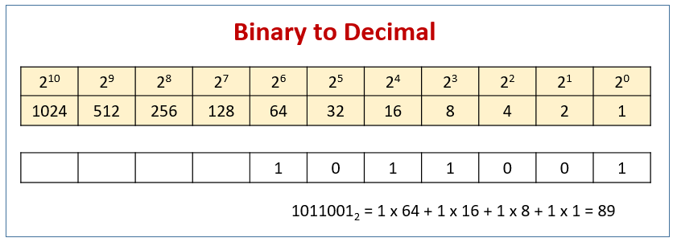
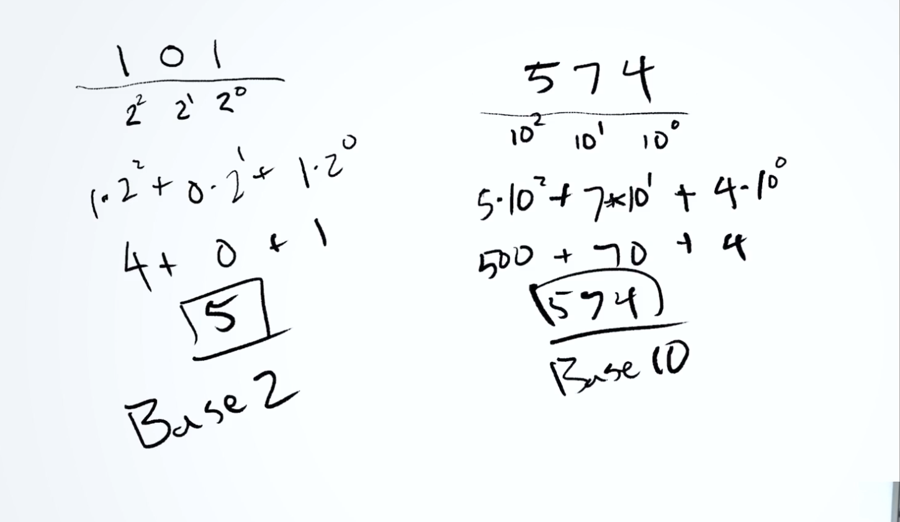
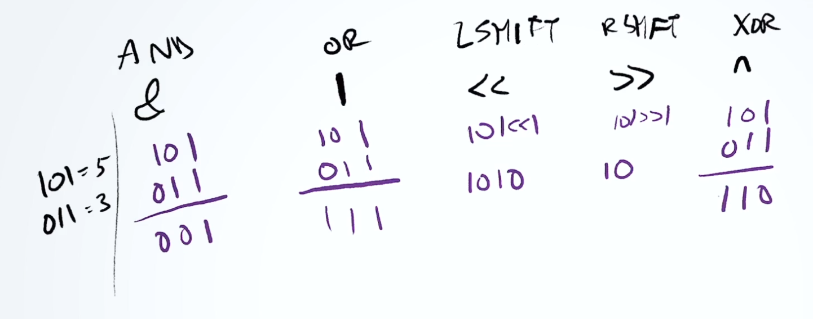
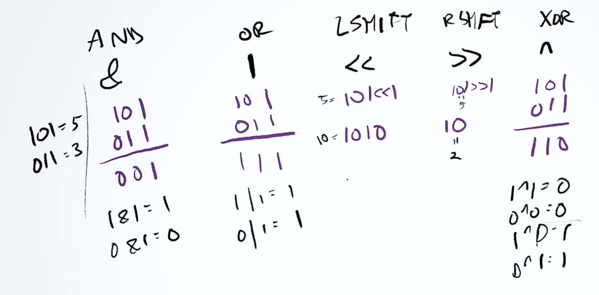

# Merge Sort

## Table of Contents

## How it works

### Binary System
The binary system, as it name implies, is base 2.

### Bitwise Operators (JavaScript)

| Operator  | Name                  | Description                                                                                               |
| --------- | --------------------- | --------------------------------------------------------------------------------------------------------- |
| &         | AND                   | Sets each bit to 1 if both bits are 1.                                                                    |
| \|        | OR                    | Sets each bit to 1 if one of two bits is 1.                                                               |
| ^         | XOR                   | Sets each bit to 1 if only one of two bits is 1.                                                          |
| ~         | NOT                   | Inverts all the bits.                                                                                     |
| <<        | Zero fill left shift  | Shifts left by pushing zeros in from the right and let the leftmost bits fall off.                        |
| >>        | signed right shift    | Shifts right by pushing copies of the leftmost bit in from the left, and let the rightmost bits fall off. |
| >>>       | Zero fill right shift | Shifts right by pushing zeros in from the left, and let the rightmost bits fall off.                      |

#### Examples

| Operation | Result | Same as      | Result |
| --------- | ------ | ------------ | ------ |
| 5 & 1     | 1      | 0101 & 0001  | 0001   |
| 5 | 1     | 5      | 0101 | 0001  | 0101   |
| ~ 5       | 10     | ~ 0101       | 1010   |
| 5 << 1    | 10     | 0101 << 1    | 1010   |
| 5 ^ 1     | 4      | 0101 ^ 0001  | 0100   |
| 5 >> 1    | 2      | 0101 >> 1    | 0010   |
| 5 >>> 1   | 2      | 0101 >>> 1   | 0010   |

## Sources
- [W3 Schools | JavaScript Bitwise Operations][1]

[1]: https://www.w3schools.com/js/js_bitwise.asp
