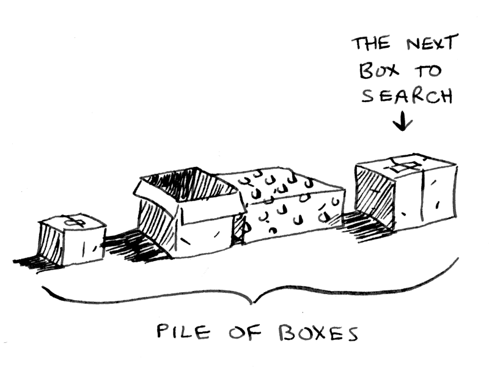

# Understanding Recursion

Recursion can be tough to understand - especially for new programmers. In its
simplest form, a recursive function is one that calls itself. Let me try to
explain with an example.

Imagine you go to open your bedroom door and it’s locked. Your three-year-old
son pops in from around the corner and lets you know he hid the only key in a
box. (“Just like him,” you think.) You're late for work and you really need to
get in the room to get your shirt.

You open the box only to find… more boxes. Boxes inside of boxes. And you don’t
know which one has the key! You need to get that shirt soon, so you have to think
of a good algorithm to find that key.

There are two main approaches to create an algorithm for this problem: iterative
and recursive. Here are both approaches as flow charts:


Which approach seems easier to you?

The first approach uses a while loop. While the pile isn’t empty, grab a box and
look through it. Here’s some JavaScript-inspired pseudocode that shows what is
happening. (Pseudocode is written like code, but meant to be more like human speech.)

```javascript
function look_for_key(main_box) {
  let pile = main_box.make_a_pile_to_look_through();
  while (pile is not empty) {
    box = pile.grab_a_box();
    for (item in box) {
      if (item.is_a_box()) {
        pile.append(item)
      } else if (item.is_a_key()) {
        console.log("found the key!")
      }
    }
  }
}
```

The second way uses recursion. Remember, recursion is where a function calls
itself. Here’s the second way in pseudocode.

```javascript
function look_for_key(box) {
  for (item in box) {
    if (item.is_a_box()) {
      look_for_key(item);
    } else if (item.is_a_key()) {
      console.log("found the key!")
    } 
  }
}
```

Both approaches accomplish the same thing. The main purpose for using the
recursive approach is that once you understand it, it can be clearer to read.
There is actually no performance benefit to using recursion. The iterative approach
with loops can sometimes be faster. But mainly the simplicity of recursion is
sometimes preferred.

Also, since a lot of algorithms use recursion, it’s important to understand how
it works. If recursion still doesn’t seem simple to you, don’t worry: I’m going to
go over a few more examples.

## Base case and recursive case (Most important part to understand)
Something you have to look out for when writing a recursive function is an infinite
loop. This is when the function keeps calling itself… and never stops calling itself!

For instance, you may want to write a count down function. You could write it
recursively in JavaScript like this:

```javascript
// WARNING: This function contains an infinite loop!
function countdown(i) {  console.log(i)  countdown(i - 1)}

countdown(5);    // This is the initial call to the function.
```


A recursive function always has to say when to stop repeating itself. There
should always be two parts to a recursive function: the **recursive case** and the
**base case**.

The **recursive case** is when the function calls itself. 
The **base case** is when the function stops calling itself. This prevents infinite loops.

Here is the countdown function again, with a base case:

```javascript
function countdown(i) {
    console.log(i)  if (i <= 1) {  // base case
        return;
    } else {     // recursive case
        countdown(i - 1);
    }
}

countdown(5);    // This is the initial call to the function.
```


It may not be obvious exactly what is happening in this function. I’ll walk through what
happens when you call the countdown function passing in `5`.

We start by printing out the number `5` using `console.log`. Since five is not less than or
equal to zero, we go to the else statement. There we call the countdown function again
with the number `four` since `(5 – 1) = 4`.

We log the number 4. Again, i is not less that or equal to zero so we go to the else
statement and call countdown with 3. This continues until i equals zero. When that
happens, we log the number zero and then i is less than or equal to zero. We finally
get to the return statement and pop out of the function.

## The Call Stack
Recursive functions use something called “the call stack.” When a program calls a
function, that function goes on top of the call stack. This similar to a stack of
books. You add things one at a time. Then, when you are ready to take something
off, you always take off the top item.

The stack datastructure is an array that specifically follows the rule of
First-In-Last-Out (FIFO).

I will show you the call stack in action with the factorial function. `factorial(5)`
is written as `5!` and it is defined like this: `5! = 5 * 4 * 3 * 2 * 1`. Here is
a recursive function to calculate the factorial of a number:

```javascript
function fact(x) {
  if (x == 1) {
    return 1;
  } else {
    return x * fact(x-1);
  }
}
```

Now let’s see what happens if you call `fact(3)` The illustration bellow shows how
the stack changes, line by line. The topmost box in the stack tells you what call
to fact you’re currently on.


Notice how **each call to fact has its own copy of x**. This is very important to making
recursion work. You can’t access a different function’s copy of x.

## Did you find the key yet?
Let’s briefly go back to the original example about looking in nested boxes for a
key. Remember, the first method was iterative using loops. With that method, you
make a pile of boxes to search through, so you always know what boxes you still
need to search.



But there is no pile in the recursive approach. How does your algorithm know which
boxes you still have to look though? The **“pile of boxes” is saved on the stack**. This
is a **stack of half-completed function calls**, each with its own half-complete list of
boxes to look through. The stack keeps track of the pile of boxes for you!

And thanks to recursion, you can finally find the key and get your shirt!

## Sources
- [How Recursion Works — Explained with Flowcharts and a Video](https://www.freecodecamp.org/news/how-recursion-works-explained-with-flowcharts-and-a-video-de61f40cb7f9/)
